# Fork U! Resource Page

## Session Resources

[View the Presentation](http://oudiglearn.github.io/olcinnovate-github/)

[Fork the Presentation](https://github.com/oudiglearn/olcinnovate-github/tree/master/presentation)

**Presenters**

Adam Croom, Director of Digital Learning, University of Oklahoma, [@acroom](https://twitter.com/acroom)

John Stewart, Asst Director of Digital Learning, University of Oklahoma, [@jstew511](https://twitter.com/jstew511)

**Session Title**

FORK U! A GITHUB APPROACH TO LEARNING AND COLLABORATION 

**Abstract**

You've heard the Git terminology ("fork," "repo," "pull") but you haven't dared to venture into the land of Github, the online network with 9 million users, more than 21.1 million repositories, and the largest host of source code in the world. While Github is a platform dominated by open source developers, it's worth understanding the use cases within higher education for courses, peer review, OER textbooks, syllabi, instructional design, and more.

We want to examine how this idea of individual ownership of one's work with a centralized hub, termed "federated" by Ward Cunningham, can alter student experience with texts and created a shared environment for faculty.

Since Fall 2014, the University of Oklahoma has been supporting learning through a Domain's of One's Own project, OU Create, which affords students with domains and open source powered web space. This has led to the creation of more than 2,000 webspaces built by students, faculty, and staff powered by tools like Wordpress and Omeka. As this primarily residential-based research institution has tip toed into the open web, the project has provided an opportunity for the OU Digital Learning team to explore platforms that allow for sharing of user-generated content amongst users (and beyond) with Github.

This workshop will provide a basic literacy of Github as well as a hands-on component where participants will work within Github to build out their first repository. These group-based activities will lay a foundation for participants to reflect on the affordances of open teaching and scholarship.


## Group Project 1: Fork the Syllabus

## Group Project 2: Peer-Review

In this group, you are going to use GitHub to provide peer review and editing for an article manuscript. The article manuscript is currently in the review phase for publication in [*Digital Pedagogy in the Humanities: Concepts, Models, and Experiments*](https://digitalpedagogy.commons.mla.org/). This project describes itself as:
>a curated collection of reusable and remixable pedagogical artifacts for humanities scholars in development by the Modern Language Association. 

Kim Middelton's article "Remix" is an apt choice for this demonstration, both in terms of its content and its current phase of production. Still in draft form, Kim's article is awaiting peer review. We will put the article into peer review and provide line-by-line feedback. Feel free to provide commentary, substantive suggestions for the text, or copy-editing notes. The point of the demonstration is to write a few lines in markdown and submit your commentary through GitHub. 

As you are working through this demonstration, please keep the instructions open in either a second window or next to you as a printout.

### Instructions

1. If you haven't yet, please create a GitHub account.

2. In the repository labeled Group2-peer_review, open the Keywords folder and click on the file labeled remix.md: https://github.com/oudiglearn/Group2-peer_review/blob/master/keywords/remix.md.  

3. Scroll through the file and look to see how the article is laid out. Notice that the meta-data for the article is presented at the top of the screen for this draft form and that the current status of the article is presented in the first section.

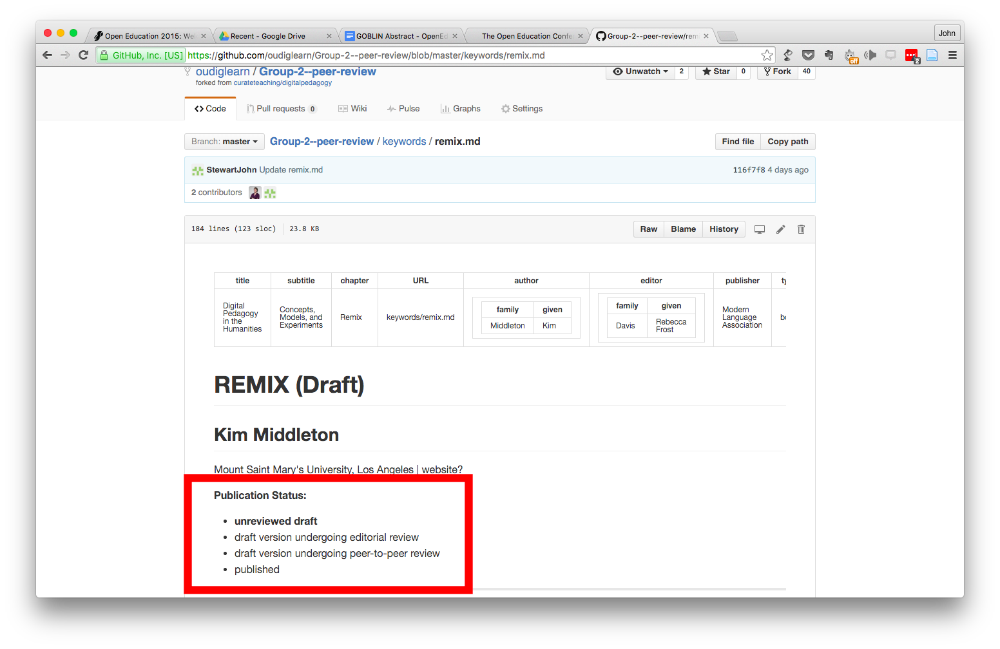

The article itself is divided into two sections: a "Curatorial Statement" about remixing and a "Curated Artifact" section which desribes several examples of remixing.

4. Click on the edit button (a pencil in the gray menu bar) at the top of the screen

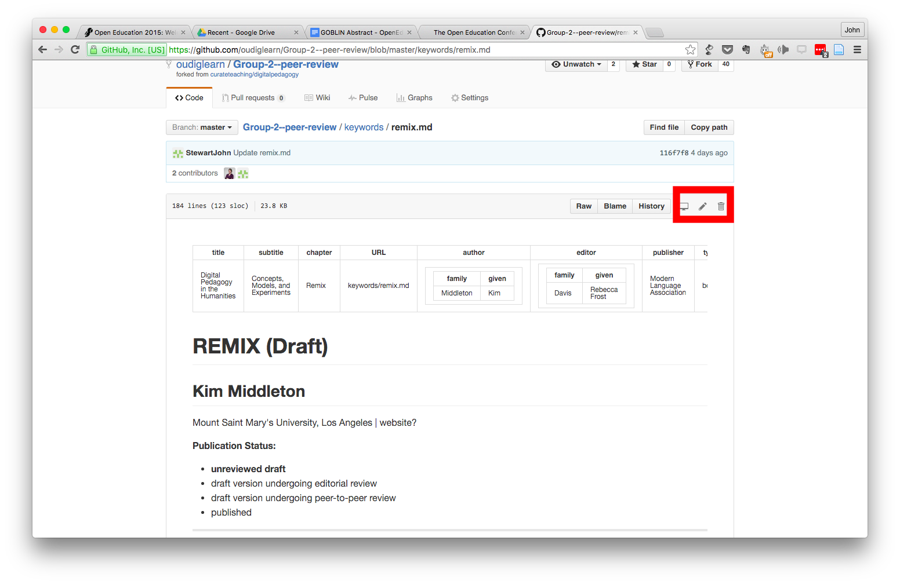

Because you don't have administrative privileges for this file, when you clicked on the edit button, GitHub created a new "forked" copy of the repository in your account's repositories. When you get done with your edits, you will save your copy of the repository and suggest that we adopt those changes through a "pull-request."  
5. In the section entitled Publication Status, change the publication status to undergoing review by changing which option is **bold**. To bold something you use <code>two astericks *</code> before and after the word. For a full cheat sheet of markdown coding, please follow this link [**Markdown Cheat Sheet**](https://github.com/adam-p/markdown-here/wiki/Markdown-Cheatsheet)

6. Add a couple of notes in the file suggesting changes. To do this add a paragraph wherever you want to make a suggestion using the format Yourname: your suggested revisions

7. When you get done making your edits, scroll to the bottom of the screen to see the "Propose File Change" section.  Add some information about your changes in the optional extended description text box. Then click the green "Propose File Change" button.

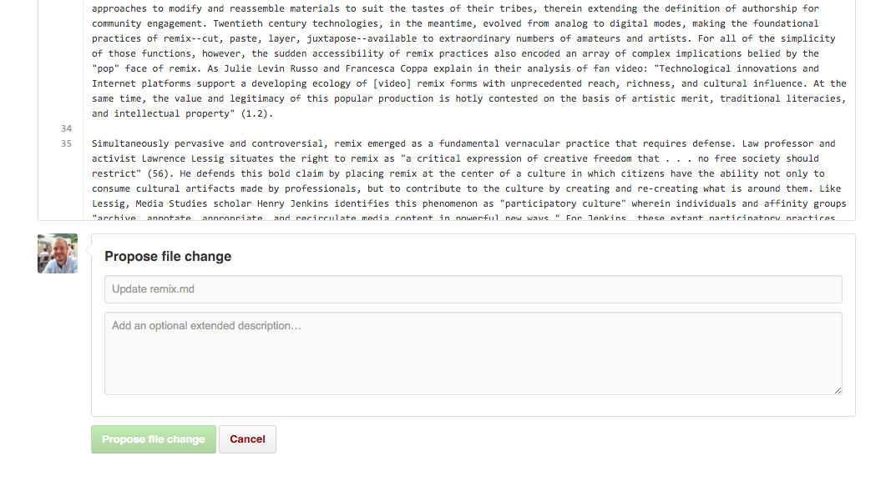

8. After you have clicked "Propose File Change" a new page will load showing a differential comparison between the old state of the "Remix" article and your modified version of the article. The older version of the file will be presented in red and the newer in green. After you have reviewed your changes, click on the green button labled "Create Pull Request."  This will submit the changed version of the "Remix" article back to our repository. 

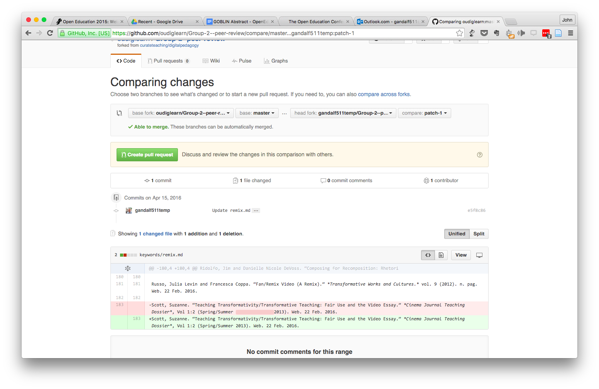

## Group Project 3: Github Pages

One of the affordances of Github Pages is that it can host static HTML webpages. Here are a couple different ways to quickly get a website up and running.

### Fork a website
Seriously. That's it. Fork another website. So let's fork this one called [Clean Blog](https://github.com/BlackrockDigital/startbootstrap-clean-blog-jekyll).

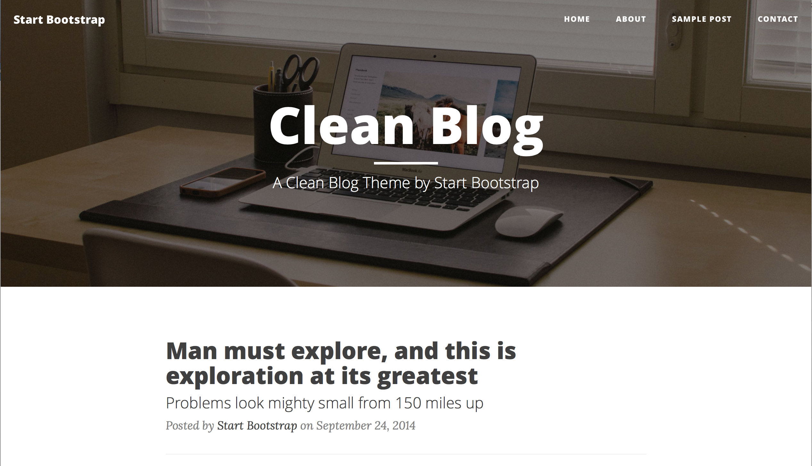

#### Jekyll
This template uses a CMS called Jekyll, which generates static HTML pages. This means that to blog we won't have to write actual HTML, instead we will write in a Github flavor of Markdown. If necessary, feel free to use this [Markdown Cheatset](https://github.com/adam-p/markdown-here/wiki/Markdown-Here-Cheatsheet).

#### Is this thing already live?!
Yes! To find your web address, click on Settings.


Now scroll down to the Github Pages section to see where your site has been published.

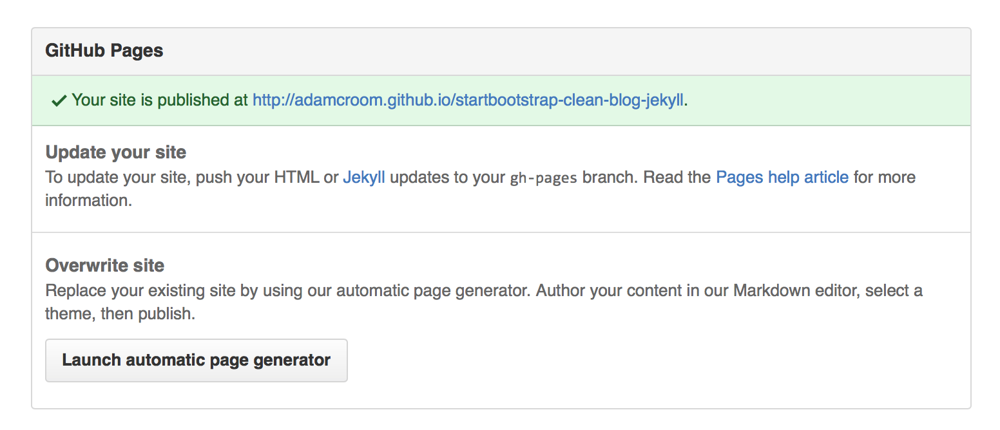

This is because Github automatically publishes repositories that have a special branch called "gh-pages." If you go back your repo home page, you'll notice gh-pages on the branches dropdown.

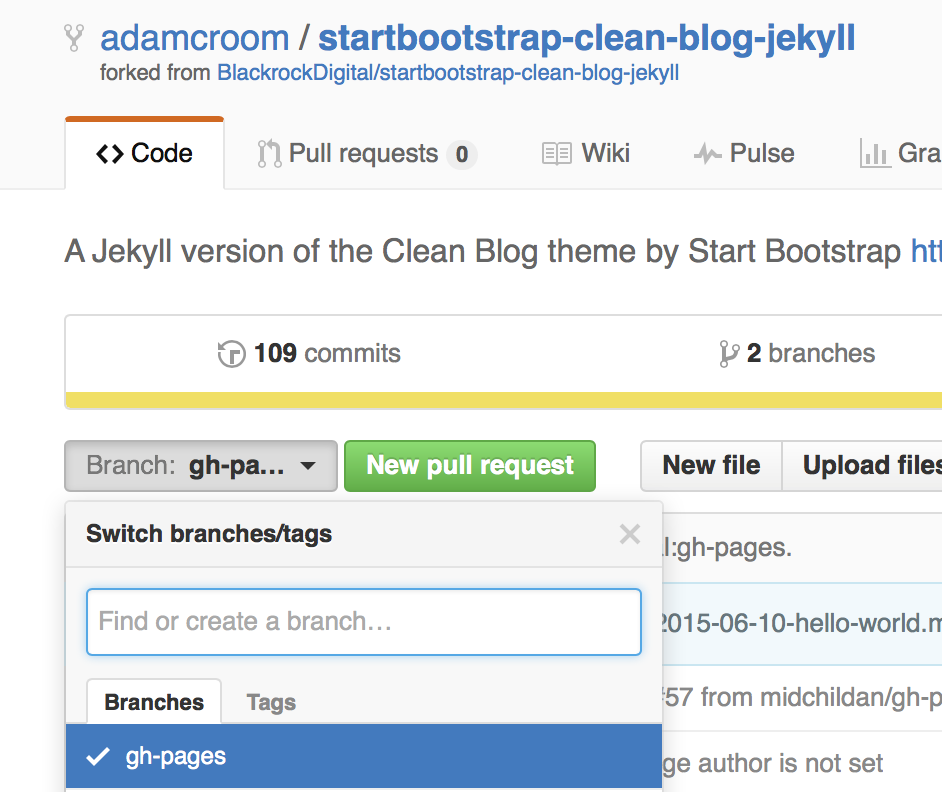

#### How can I write a post?
Click on the folder in your repository labeled "_posts".

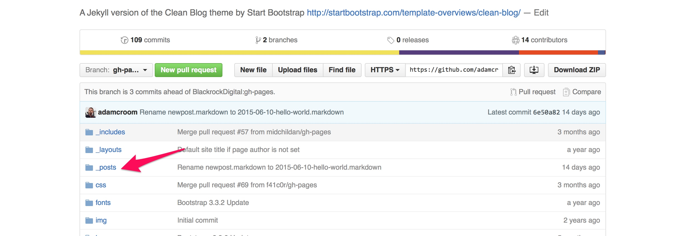

You'll find a set of posts already in there labeled in a format of YYYY-MM-DD-title-goes-here.markdown. Let's go ahead and edit one of them to see how this works. Click on the file label "2015-06-10-hello-world.markdown" and then click the pencil icon to edit the file.

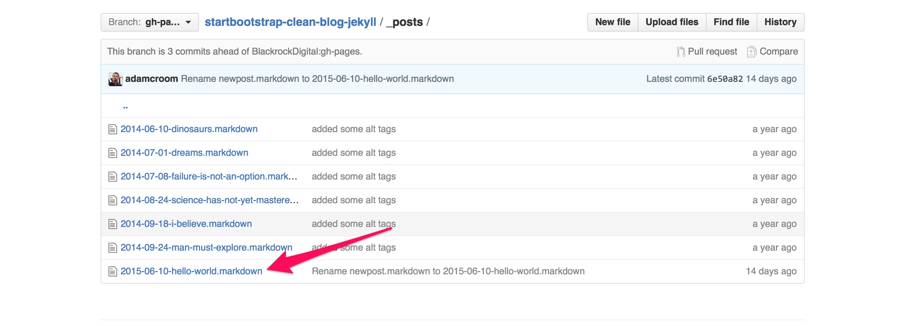


What you see here is some formatting data at the top that looks like this:

```
---
layout:     post
title:      "Hello world"
subtitle:   "because they lacked opposable thumbs and the brainpower to build a space program."
date:       2015-06-10 12:00:00
author:     "Start Bootstrap"
header-img: "img/post-bg-01.jpg"
---
```

This is called YAML (yet another markup language). This theme has HTML templates that know to associate specific fields styling. For instance, it knows this is a post because the layout associated with it is "post." It also knows the title, subtitle, data, author, and header image. Play around with changing the title and subtitle as well as the date. 

*Warning: do not change the layout or it will no longer know that it's a post!

Similarly, add content your blog post by replacing "Hello?" located directly below the YAML content.

Once you are done, you'll want to Commit your change.

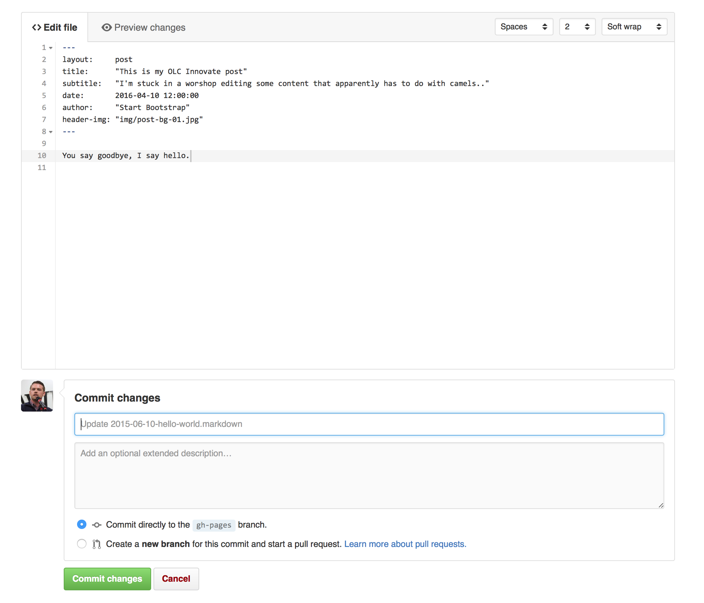

Now go back to Settings recover that link and you'll see the changes take place (you may need to refresh the page).

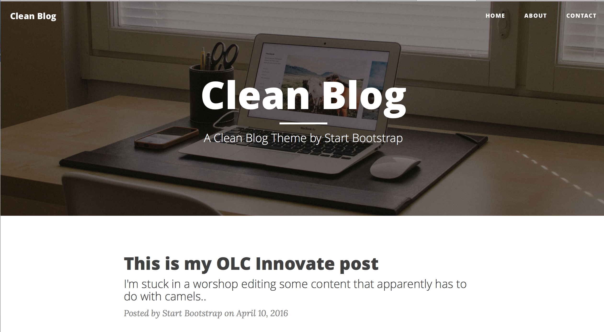

You can, of course, create new blog posts too. To do that, go back into your _posts folder and create a new file. Make sure you stick with the file format `YYYY-MM-DD-title.markdown`. You'll also want to add the YAML at the top of the post:


```
---
layout:     post
title:      
subtitle:   
date:       YYYY-MM-DD 12:00:00
author:   
header-img:
---
```

### Hosting HTML
As mentioned earlier, Github can simply host HTML as well. Here are some directions on how to do that.

#### Create a gh-pages branch
Create a new repository, or go to an existing one. In the repository overview, click the branch drop-down on the left-hand side. Type in gh-pages and press enter.


#### Create an index file
Use the plus icon next to the repository name to create a new file.


Name the file `index.html` and type in `Hello World` for the content.


#### Commit the file
Scroll to the bottom of the page, write a commit message, and commit the new file.


#### ...and you're done!
Go to http://username.github.io/repository.


## Glossary

**Blame**

The "blame" feature in Git describes the last modification to each line of a file, which generally displays the revision, author and time. This is helpful, for example, in tracking down when a feature was added, or which commit led to a particular bug.

**Branch**

A branch is a parallel version of a repository. It is contained within the repository, but does not affect the primary or master branch allowing you to work freely without disrupting the "live" version. When you've made the changes you want to make, you can merge your branch back into the master branch to publish your changes.

**Clone**

A clone is a copy of a repository that lives on your computer instead of on a website's server somewhere, or the act of making that copy. With your clone you can edit the files in your preferred editor and use Git to keep track of your changes without having to be online. It is, however, connected to the remote version so that changes can be synced between the two. You can push your local changes to the remote to keep them synced when you're online.

**Collaborator**

A collaborator is a person with read and write access to a repository who has been invited to contribute by the repository owner.

**Commit**

A commit, or "revision", is an individual change to a file (or set of files). It's like when you save a file, except with Git, every time you save it creates a unique ID (a.k.a. the "SHA" or "hash") that allows you to keep record of what changes were made when and by who. Commits usually contain a commit message which is a brief description of what changes were made.

**Contributor**

A contributor is someone who has contributed to a project by having a pull request merged but does not have collaborator access.

**Diff**

A diff is the difference in changes between two commits, or saved changes. The diff will visually describe what was added or removed from a file since its last commit.

**Fetch**

Fetching refers to getting the latest changes from an online repository (like GitHub.com) without merging them in. Once these changes are fetched you can compare them to your local branches (the code residing on your local machine).

**Fork**

A fork is a personal copy of another user's repository that lives on your account. Forks allow you to freely make changes to a project without affecting the original. Forks remain attached to the original, allowing you to submit a pull request to the original's author to update with your changes. You can also keep your fork up to date by pulling in updates from the original.

**Git**

Git is an open source program for tracking changes in text files. It was written by the author of the Linux operating system, and is the core technology that GitHub, the social and user interface, is built on top of.

**Issue**

Issues are suggested improvements, tasks or questions related to the repository. Issues can be created by anyone (for public repositories), and are moderated by repository collaborators. Each issue contains its own discussion forum, can be labeled and assigned to a user.

**Markdown**

Markdown is an incredibly simple semantic file format, not too dissimilar from .doc, .rtf and .txt. Markdown makes it easy for even those without a web-publishing background to write prose (including with links, lists, bullets, etc.) and have it displayed like a website. GitHub supports Markdown, and you can learn about the semantics here.

**Merge**

Merging takes the changes from one branch (in the same repository or from a fork), and applies them into another. This often happens as a Pull Request (which can be thought of as a request to merge), or via the command line. A merge can be done automatically via a Pull Request via the GitHub.com web interface if there are no conflicting changes, or can always be done via the command line. See Merging a pull request.

**Open Source**

Open source software is software that can be freely used, modified, and shared (in both modified and unmodified form) by anyone. Today the concept of "open source" is often extended beyond software, to represent a philosophy of collaboration in which working materials are made available online for anyone to fork, modify, discuss, and contribute to.

**Organizations**

Organizations are a group of two or more users that typically mirror real-world organizations. They are administered by users and can contain both repositories and teams.

**Private Repository**

Private repositories are repositories that can only be viewed or contributed to by their creator and collaborators the creator specified.

**Pull**

Pull refers to when you are fetching in changes and merging them. For instance, if someone has edited the remote file you're both working on, you'll want to pull in those changes to your local copy so that it's up to date.

**Pull Request**

Pull requests are proposed changes to a repository submitted by a user and accepted or rejected by a repository's collaborators. Like issues, pull requests each have their own discussion forum. See Using Pull Requests.

**Push**

Pushing refers to sending your committed changes to a remote repository such as GitHub.com. For instance, if you change something locally, you'd want to then push those changes so that others may access them.

**Remote**

This is the version of something that is hosted on a server, most likely GitHub.com. It can be connected to local clones so that changes can be synced.

**Repository**

A repository is the most basic element of GitHub. They're easiest to imagine as a project's folder. A repository contains all of the project files (including documentation), and stores each file's revision history. Repositories can have multiple collaborators and can be either public or private.

**SSH Key**

SSH keys are a way to identify yourself to an online server, using an encrypted message. It's as if your computer has its own unique password to another service. GitHub uses SSH keys to securely transfer information from GitHub.com to your computer.

**Upstream**

When talking about a branch or a fork, the primary branch on the original repository is often referred to as the "upstream", since that is the main place that other changes will come in from. The branch/fork you are working on is then called the "downstream".

**User**

Users are personal GitHub accounts. Each user has a personal profile, and can own multiple repositories, public or private. They can create or be invited to join organizations or collaborate on another user's repository.


## Other Resources
Zagalsky, Alexey, et al. ["The emergence of GitHub as a collaborative platform for education."](http://alexeyza.com/pdf/cscw15.pdf) Proceedings of the 18th ACM Conference on Computer Supported Cooperative Work & Social Computing. ACM, 2015.

**Chronicle Series "Github 101"**

- [Getting Started With a GitHub Repository](http://chronicle.com/blogs/profhacker/getting-started-with-a-github-repository/47393)

- [Direct Editing and Zen Mode in GitHub](http://chronicle.com/blogs/profhacker/direct-editing-and-zen-mode-in-github/47497)

- [Forks and Pull Requests in GitHub](http://chronicle.com/blogs/profhacker/forks-and-pull-requests-in-github/47753)

- [File and Repository History in GitHub](http://chronicle.com/blogs/profhacker/file-and-repository-history-in-github/48047)

- [Resources for Learning Git and GitHub](http://chronicle.com/blogs/profhacker/resources-for-learning-git-and-github/48285)

- [The Limitations of GitHub for Writers](http://chronicle.com/blogs/profhacker/the-limitations-of-github-for-writers/48299)
